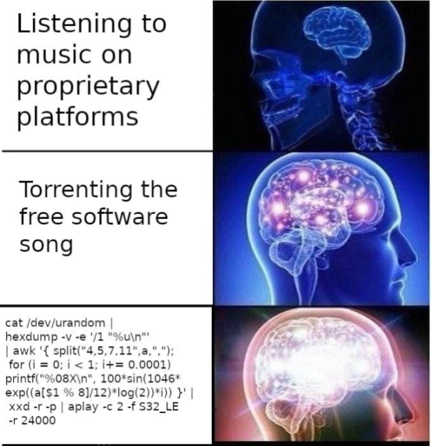
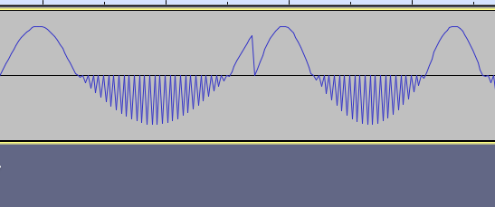

# Shelltunes

This project was inspired by this meme:

Here is the transcribed version of the command.

`cat /dev/urandom | hexdump -v -e '/1 "%u\n"' | awk '{ split("4,5,7,11",a,","); for (i = 0; i < 1; i += 0.0001) printf("%08X\n", 100*sin(1046*exp((a[$1 % 8]/12)*log(2))*i)) }' | xxd -r -p | aplay -c 2 -f S32_LE -r 24000`

This seemed interesting so I started poking around. You can read more about what I learned [here](awk-howitworks.md). In the end I remade it as a python script so I could give things nicer names and make it more customizable.

The main reason for making this script was to prevent the harsh pops when the note changes because the tone suddenly cuts from one tone to another with no warning.

This python script primarily addresses this second point and includes some code to ensure that generated waveforms end at a reasonable location so the start of the new tone continues the waveform and doesnt create a harsh pop.

See the [sample mp3](sample.mp3) for an example of how it can sound.

## Usage
`python3 tunes.py | awk '{ printf("%08X\n",$1) }' | xxd -r -p | aplay -c 2 -f S32_LE -r 24000`

Feel free to play with the parameters in the script to customize it.
Pretty much any of the variables or function parameters can be messed with.

## Future ideas

I wonder if this concept (but probably not this script) could be used to create a FOSS version of something like spotify, except:
- theres no need to stream anything, your player generates the music on the fly, so no worries about data use or disk space
- the music is randomly generated, so probably isnt copyrightable
- theres quite a lot of room for variability