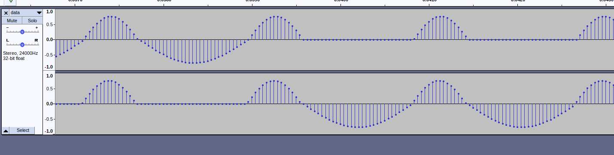

Here are some notes and edits that I made when modifying the version of the script in the meme:

1. The 2 channel audio in the original seems to be randomly putting the bottom half of the waveform in a different channel. 
	
	This might be intentional, but i fixed it anyway.
	`cat /dev/urandom | hexdump -v -e '/1 "%u\n"' | awk '{ split("4,5,7,11",a,","); for (i = 0; i < 1; i += 0.0001) printf("%08X\n", 50*sin(1046*exp((a[$1 % 8]/12)*log(2))*i)) }' | xxd -r -p | aplay -c 1 -f S32_LE -r 48000`
2. change the speed/pitch (this makes it slower and sadder sounding)
   `cat /dev/urandom | hexdump -v -e '/1 "%u\n"' | awk '{ split("4,5,7,11",a,","); for (i = 0; i < 1; i += 0.00005) printf("%08X\n", 100*sin(1046*exp((a[$1 % 8]/12)*log(2))*i)) }' | xxd -r -p | aplay -c 2 -f S32_LE -r 24000`
3. This one sounds pretty good too
	`cat /dev/urandom | hexdump -v -e '/1 "%u\n"' | awk '{ split("4,5,7,11",a,","); for (i = 0; i < 1; i += 0.00008) printf("%08X\n", 100*sin(1046*exp((a[$1 % 8]/12)*log(2))*i)) }' | xxd -r -p | aplay -c 2 -f S32_LE -r 24000`

## How this script works

1. Generate random data
2. pass it through hexdump to get integers from 0-255 (?) one per line
4. for each line of this random data into an awk script. This script picks from one of five notes (one is a fallback) based on the random data and generates about 10,000 samples from a sine wave for that tone
5. These samples are printed, also one per line, as hex, then put back into raw binary
6. this is piped through into `aplay` to play it back

I also make a [desmos calculator](https://www.desmos.com/calculator/fzd5qfnxzz) to try and understand how it makes a sine wave. Its kind of complicated and i never really finished.

## Some other things you can do

Playing around with the different parts of the shell script let you do things like:
- feed your own data in (maybe you want to play a particular binary file?)
- have it write the PCM data to a file to open in other audio programs or transcode

**NOTE:**
Without aplay on the end acting as a rate limiter, this script generates SO MUCH DATA. In less than a second I got a 24 MB file. If you plan to save the output, plan to press enter and then ctrl-C IMMEDIATELY.

The music can generate WAY faster than it can be played back.

### save data as hex to a file
`cat /dev/random | hexdump -v -e '/1 "%u\n"' | awk '{ split("4,5,6,7,8,9,10,11",a,","); for (i = 0; i < 1; i += 0.00008) printf("%08X\n", 99*sin(1048*exp((a[$1 % 8]/12)*log(2))*i)) }' > data.dat`

### save data as integers (one per line) to a file
`cat /dev/random | hexdump -v -e '/1 "%u\n"' | awk '{ split("4,5,6,7,8,9,10,11",a,","); for (i = 0; i < 1; i += 0.00008) printf("%d\n", 99*sin(1048*exp((a[$1 % 8]/12)*log(2))*i)) }' > data.dat`

### playback a previously saved integer file
`cat data.dat | awk '{ printf("%08X\n",$1) }' | xxd -r -p | aplay -c 2 -f S32_LE -r 24000`

### playback a previously saved hex file
`cat data.dat | xxd -r -p | aplay -c 2 -f S32_LE -r 24000`

### convert saved integers file to binary PCM data 
audacity can open this if you use `Import > Raw Data` or something similar

`cat data.dat | awk '{ printf("%08X\n",$1) }' | xxd -r -p > data.pcm`
